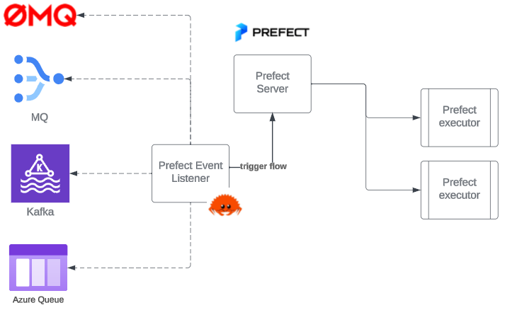

# Prefect Event Router

This is an asynchronous event handler written in **Rust** that is used to handle events that should kick-off a prefect flow. It is a simple handler that listens to some queue/socket-like source to kick off prefect flows.

## Why
As an open source user of Prefect, there is no native support for an event-driven architecture (without having to use prefect cloud). Working in a business with incoming events that should trigger a flow, I needed a way to listen to these events and kick off a flow in Prefect all within our private network.

## How it works
The event handler is a simple tokio rust application that asynchronously listens to multiple streams and can kicks off a prefect flow depending on the type of message received to any of the target message streams.

#### Architecture diagram


## Usage
The application works by using a JSON config file for the queue-message type-flow mapping. A config is passed to each async thread thats created to listen to a queue. 

Here's an example:
`example-config.json`
```js
{
    "threads": [
        {
            "publisher_type": "AzureStorageQueue",
            "storage_account": "storage-account-name",
            "queue_name": "test",
            "message_flow_actions": {
                // If the thread receives a JSON message with message-type="MyMessageType"
                // it will kick-off the below prefect flow deployment
                "MyMessageType": "Flow Name/deployment-name"
            }
        },
        // From the bundled example:
        {
            "publisher_type": "StdInput",
            "message_flow_actions": {
                "SampleMsg": "Test Flow/integration-test",
                "ParamsMsg": "Test Flow with params/integration-test"
            }
        }
    ]
}
```
The binary listener is then run using the following command. Each thread runs forever until a SIGKILL is sent to the main process.
```bash
./prefect-event-handler example-config.json
```
## Example

Perhaps the best way to demonstrate how this works is to use the included example in this repo. Here we will setup a local prefect instance in a dedicated local venv, deploy twos flows and then run the `prefect-evente-handler` to receive messages from stdinput that will be used to kick off our test flows.

### Setup
>Prequisites: Cargo and Python must be installed prior to running this setup.

To setup, simply run `make setup-prefect-test`
1. Setup a local prefect server in a python virtualenv in the `prefect-testing/` directiory.
1. Deploy two flows from `prefect-testing/test_flow.py` - one without parameters and one with.

### Running the example
To see this in full action, open three separate terminals to simulate the 3 processes that work in tandem:
1. In terminal 1, run: `make start-prefect` - this will start a local prefect server. Here you can view flows in action from the GUI.
1. In terminal 2, run: `make start-worker` - this starts the worker process that will actually execute the flows that have been initiated by our handler.
1. In the final terminal, run: `make run-example` - this exceutes our compiled handler process using the `test.json` configuration provided in this repo.

> You may see some SQLAlchemy errors when you start up the prefect processes - just ignore these, they're irrelevant to this test and don't prevent it from working.

The test json:
```json
{
    "threads": [
        {
            "publisher_type": "StdInput",
            "message_flow_actions": {
                "SampleMsg": "Test Flow/integration-test",
                "ParamsMsg": "Test Flow with params/integration-test"
            }
        }
    ]
}
```
You can see from this json that our handler will create one listener thread that will await input from `stdin`. Depending on the message received, it will either execute 1 of two different flows (these were both deployed in the setup). 

Messages should be received in JSON format. For the first message, this is the expected input. paste this into the terminal and you should see the prefect flow in terminal 2, beginning to kick-off.
```json
{"message_type": "SampleMsg"}
```

Now try dropping in a message for the second flow that takes parameters. You should see the flow in prefect being executed with the payload provided:
```json
{"message_type": "ParamsMsg", "payload": {"name": "Gordon Bennett"}}
```

Simple!

Once finished, to clear out the example venv and config, just run `make reset-prefect-test`.

# Beyond the example

## Setup

A few environment variables are required to get started.
The first is the URI to your prefect instance. (If you're running this application on the same machine as your prefect server, this is commonly `http://127.0.0.1:4200/api`)
```bash
export PREFECT_API_URI="https://your-prefect-server@example.com/api"
```

### Server Authentication
> NB. Only applies if you've explicitly added authentication to your prefect server.
The standard way to authenticate to prefect cloud is by using a JWT. This application supports the same pattern for self-hosted prefect servers that have implemented this feature.
Simply set the following environment variable to trigger authentication:
```bash
export PREFECT_API_KEY="your-api-key"
```

### Publisher Authentication
#### Azure
The application uses the `DefaultAzureCredential` to authenticate with Azure storage accounts. This means that it will use the environment variables or the managed identity of the VM it is running on to authenticate.


## Main Features
- [x] Add simple stdin example
- [x] Add Azure Storage Queue support
- [ ] Add ØMQ support
- [ ] Add Kafka Support
- [ ] Add a logging system to log the messages received and the flows kicked off

## Building
To build the event handler, you need to have rust and cargo installed. You can install rust using rustup. Once you have rust installed, you can build the event handler using the following command:
```bash
cargo build --release
```
